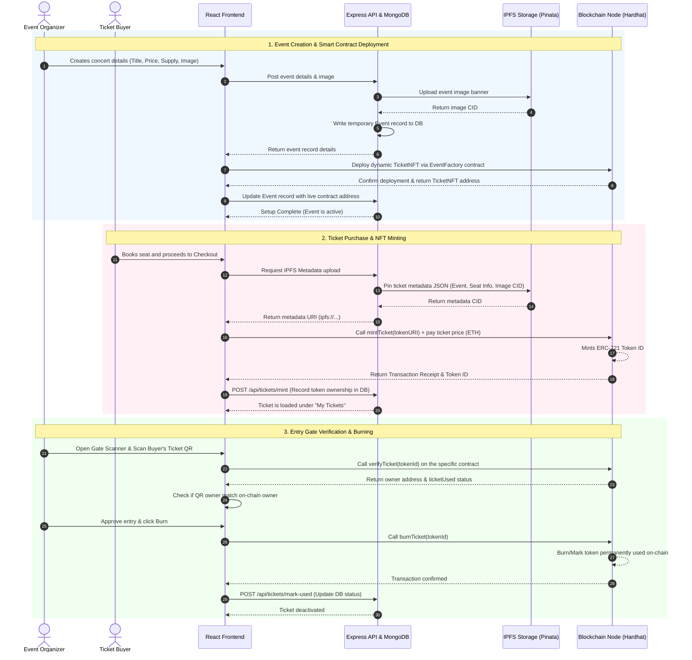

# BlockTicket — Blockchain-Based Event Ticketing & Fraud Prevention Platform

BlockTicket is a decentralized, trustless, and secure event ticketing system designed to eliminate fake tickets, black-market scalping, double-scanning, and unauthorized ticket reuse. By representing each ticket as a unique ERC-721 NFT on the blockchain, and storing assets on IPFS, it bridges physical entry controls with digital immutable ledgers.

---

## 1. Directory Structure & Layout

The codebase is organized as follows:

```
Blockchain/
├── ticketer-app/                  # Core application package
│   ├── blockchain/               # Smart contract compilation, testing, and deployment (Hardhat)
│   │   ├── contracts/            # Solidity files (NFTs, Marketplace, Factory)
│   │   ├── scripts/              # Hardhat deployment scripts
│   │   └── test/                 # Chai/Mocha smart contract unit tests
│   │
│   ├── backend/                  # REST API Server (Express + MongoDB)
│   │   ├── config/               # Database and IPFS client configurations
│   │   ├── controllers/          # Business logic handlers
│   │   ├── models/               # Mongoose database schemas
│   │   └── routes/               # API route declarations
│   │
│   └── src/                      # Single Page Application Frontend (React + Vite)
│       ├── components/           # Reusable UI components & guards
│       ├── contracts/            # Deployed ABIs and addresses
│       └── pages/                # Screen views (Dashboards, Markets, Success screens)
│
└── README.md                     # Root high-level documentation (this file)
```

---

## 2. Detailed System Architecture

BlockTicket integrates a web front-end, an Express database synchronization api, decentralized IPFS storage, and Solidity smart contracts.

### System Sequence Flow Diagram
Below is the sequence of interactions when an organizer creates an event, a buyer purchases a ticket, and a gatekeeper validates it:



---

## 3. Core Technical & Blockchain Concepts

1. **ERC-721 Non-Fungible Tokens**: Each ticket is represented as a unique token ID on the blockchain, storing metadata immutably.
2. **Factory Contract Pattern**: Organizers deploy isolated ERC-721 contract addresses for every individual event. This secures and isolates funds, ownership controls, and supply caps.
3. **Resale Price Ceilings**: The marketplace smart contract retrieves the maximum allowed price of a token on-chain (`originalPrice * resalePriceCap / 100`) and rejects transactions listing tickets above this threshold, eliminating scalping.
4. **Ticket Invalidation (Burning)**: Marking tickets as used or burning them on entry ensures that tickets cannot be copied, transferred, or scanned multiple times.
5. **Decentralized Storage (IPFS)**: Ticket descriptions, seat locations, and banner assets are stored in decentralized storage to guarantee durability and proof-of-authenticity.

---

## 4. Setup & Running Guide (End-to-End Localhost)

To run the entire system locally, follow these steps in order.

### Prerequisites
* **Node.js** (v18 or higher recommended)
* **MongoDB** (running locally or a remote MongoDB Atlas URI)
* **MetaMask** extension installed in your web browser
* **Pinata API Keys** (for IPFS metadata pinning)

---

### Step 1: Run the Local Blockchain Node
1. Navigate to the blockchain directory:
   ```bash
   cd ticketer-app/blockchain
   ```
2. Install dependencies:
   ```bash
   npm install
   ```
3. Start the Hardhat local EVM node:
   ```bash
   npx hardhat node
   ```
   *Keep this terminal window open. It will print 20 local development addresses and private keys.*

---

### Step 2: Deploy the Core Smart Contracts
1. Open a new terminal window and navigate to the blockchain directory:
   ```bash
   cd ticketer-app/blockchain
   ```
2. Run the deployment script to deploy the `EventFactory` and `TicketMarketplace` contracts:
   ```bash
   npx hardhat run scripts/deploy.js --network localhost
   ```
   *This automatically creates `addresses.js` in the frontend `src/contracts` folder containing the deployed addresses.*

---

### Step 3: Configure and Start the Backend Server
1. Navigate to the backend directory:
   ```bash
   cd ticketer-app/backend
   ```
2. Install dependencies:
   ```bash
   npm install
   ```
3. Create a `.env` file in the `backend` folder and populate it with your settings:
   ```env
   PORT=5000
   MONGODB_URI=mongodb://127.0.0.1:27017/blockticket
   JWT_SECRET=your_jwt_signing_secret_here
   PINATA_API_KEY=your_pinata_key
   PINATA_SECRET_KEY=your_pinata_secret
   PINATA_GATEWAY=https://gateway.pinata.cloud
   ```
4. Start the backend development server:
   ```bash
   npm run dev
   ```

---

### Step 4: Configure and Start the Frontend Application
1. Navigate to the root application directory:
   ```bash
   cd ticketer-app
   ```
2. Install dependencies:
   ```bash
   npm install
   ```
3. Start the Vite React development server:
   ```bash
   npm run dev
   ```
   *Open `http://localhost:5173` in your browser.*

---

### Step 5: Setup MetaMask Accounts
To simulate users, import the first three Hardhat accounts into MetaMask:

1. **Local Network Configuration**:
   - Add a manual network: Network Name `Hardhat Local`, RPC URL `http://127.0.0.1:8545`, Chain ID `1337` (or `31337`), Symbol `ETH`.
2. **Account #0 (Organizer - Alice)**:
   - Private Key: `0xac0974bec39a17e36ba4a6b4d238ff944bacb478cbed5efcae784d7bf4f2ff80`
3. **Account #1 (Buyer 1 - Bob)**:
   - Private Key: `0x59c6995e998f97a5a0044966f0945389dc9e86dae88c7a8412f4603b6b78690d`
4. **Account #2 (Buyer 2 - Charlie)**:
   - Private Key: `0x5de4111e5eb130765053b0a2f8d318517769b0a875a68d1b212cfbcbc0cf4141`

*Note: If you encounter transaction reverts when redeploying or restarting Hardhat, clear MetaMask's activity logs via Settings -> Advanced -> Clear activity tab data.*

---

## 5. Contributing Guidelines

We welcome contributions to BlockTicket! To maintain code quality, please adhere to these steps:

1. **Fork the Repository**: Create a personal copy of the project.
2. **Create a Feature Branch**:
   ```bash
   git checkout -b feature/amazing-feature
   ```
3. **Write Unit Tests**: When modifying smart contracts, add test assertions to `ticketer-app/blockchain/test/TicketNFT.test.js`. Ensure all checks pass:
   ```bash
   npx hardhat test
   ```
4. **Commit with Conventions**: Keep commit messages clear, descriptive, and atomic.
5. **Open a Pull Request**: Submit your changes for review to the main repository development branch.

---

## 6. License & License Terms
Distributed under the MIT License. See standard license terms for details.
